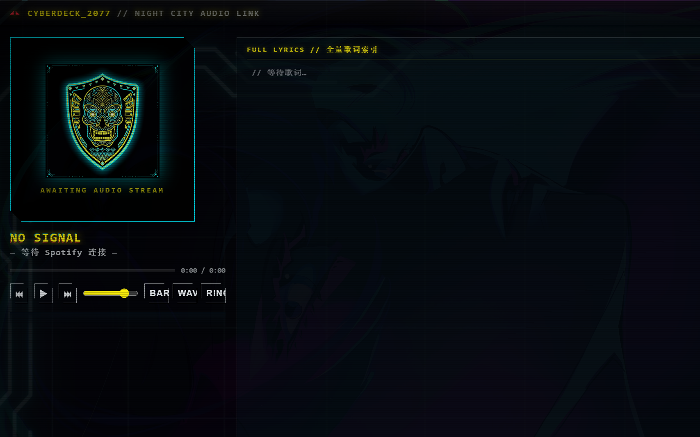

# CYBERDECK_2077 · 赛博朋克 Spotify 桌面音乐台



一个赛博朋克 2077 风格的 Windows 桌面音乐可视化程序，为副屏/第二显示器而生：
实时系统音频频谱 + Spotify 播放控制 + 双语源滚动歌词 + AI 生成视觉素材。

> 非官方项目，与 Spotify、CD Projekt Red 无任何关联。视觉为风格致敬，不含官方素材。

## 功能

- **实时频谱动效**：WASAPI 系统声音环回捕获（Electron desktopCapturer），任意音源驱动；BARS / WAVE / RING 三种模式
- **SPOT 模式**：频谱仅在 Spotify 于本机播放时响应，其他声音不触发
- **Spotify 集成**（Web API + PKCE 授权）：封面 / 歌名 / 进度 / 播放控制 / 音量 / 自动切换播放设备
- **歌词**：LRCLIB 与网易云双源并行（8s 超时防卡死），逐行高亮 + 景深渐隐 + 丝滑跟随滚动 + 点击跳转 + 每首歌独立的偏移微调
- **赛博朋克视觉**：AI 生成背景（4 张每分钟轮换淡入淡出）+ 般若徽章 + HUD 纹理 + 扫描线 + glitch 标题
- **窗口行为**：无边框、默认铺满第二显示器、位置/透明度记忆、置顶、托盘驻留

## 运行

1. 安装 [Node.js](https://nodejs.org) (>=18)
2. `npm install`（国内慢可设 `ELECTRON_MIRROR=https://npmmirror.com/mirrors/electron/`）
3. 双击 `启动.bat` 或 `npm start`

## Spotify 配置（一次性，约 2 分钟）

1. 打开 https://developer.spotify.com/dashboard → **Create app**
2. **Redirect URIs** 添加：`http://127.0.0.1:8901/callback`
3. 勾选 **Web API** 与 **Web Playback SDK**，保存
4. 复制 **Client ID**，粘贴进程序弹出的配置窗 → 保存并连接 → LOGIN → 同意授权
5. 需要 **Premium** 账号；开发模式下授权账号需在应用的 User Management 白名单内（2026 年 2 月新规）

## 目录结构

```
main/        Electron 主进程（窗口/托盘/OAuth 回调服务器/HTTP 代理）
renderer/    界面与逻辑（visualizer 频谱 / spotify Web API / lyrics 双源）
assets/      AI 生成素材（bg*.png 背景轮换 / emblem 徽章 / hud 纹理）
启动.bat     Windows 一键启动
```

## 自定义

- 换背景：把 1920x1080 图片命名为 `bg.png`~`bg3.png` 覆盖 `assets/` 下同名文件
- 配色：`renderer/styles.css` 顶部 `:root` 变量（黄=焦点 / 白=正文 / 青=线条 / 红=警示）

## 已知限制

- 频谱为系统级环回捕获，Windows 不允许单独抓取某进程声音；SPOT 模式以"Spotify 是否在本机播放"作为开关
- 歌词源为非官方接口，可能失效；双源 + 超时兜底
- 歌词偏移按歌曲记忆于本地 localStorage

## License

MIT
